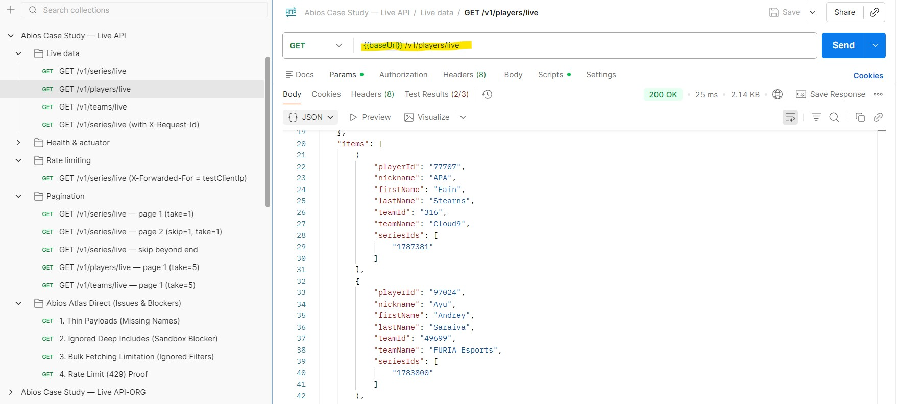

# Live Esports Data Service (Abios Case Study)

[](https://spring.io/projects/spring-boot)
[](https://www.oracle.com/java/technologies/javase/jdk21-archive-downloads.html)
[](https://www.docker.com/)

A resilient Spring Boot microservice that aggregates live esports data from the **Abios Atlas API**. Acts as a "Live Data Hub" — delivers deduplicated, reshaped snapshots of ongoing series, teams, and players from a single cached upstream call.

**More detail:** [`docs/`](docs/) — architecture deep-dives, caching strategy, parallel enrichment, streaming parser migration, and the Atlas pagination reference. **This README** is the short demo map (what to run and open first).

---

## Table of Contents
1. [Prerequisites](#prerequisites)
2. [Quick Start](#quick-start)
3. [Scripts](#scripts)
4. [Service URLs](#service-urls)
5. [Tests](#tests)
6. [Core Requirements](#core-requirements)
7. [Architecture Overview](#architecture-overview)
8. [Technical Achievements](#technical-achievements)
9. [Trade-offs & Design Decisions](#trade-offs--design-decisions)
10. [Edge Cases Handled](#edge-cases-handled)
11. [Production Readiness Score](#production-readiness-score)
12. [Roadmap](#roadmap)
13. [AI-Assisted Development](#ai-assisted-development)

---

## Prerequisites

- **Docker** (with Compose v2) — all build and run steps execute inside containers; no local JDK or Maven required.
- **Bash** (Linux, macOS, or Git Bash on Windows) for the helper scripts.
- An **Abios API key** only if you want to run against the real Atlas API (mock works without one).

---

## Quick Start

**Mock data (no API key needed):**
```bash
chmod +x scripts/*.sh
./scripts/run.sh
```

**Real Atlas integration:**
```bash
# Option 1: Set the API key directly
export ABIOS_API_KEY=your_secret_here
./scripts/run-atlas.sh

# Option 2: Copy the example env file and add your API key
cp env.example .env
# edit .env and set ABIOS_API_KEY=your_secret_here
./scripts/run-atlas.sh
```

The API is available at `http://localhost:8080`. Use `Ctrl+C` or `./scripts/stop.sh` to stop.

---

## Scripts

| Script | Purpose |
|---|---|
| [`build.sh`](scripts/build.sh) | Compile and package the JAR (runs Maven inside Docker; skips tests). |
| [`run.sh`](scripts/run.sh) | Start the full stack (app + Redis) with **mock** data. Default for local dev. |
| [`run-atlas.sh`](scripts/run-atlas.sh) | Same as `run.sh` but activates the `atlas` Spring profile — real Abios HTTP calls. Requires `ABIOS_API_KEY`. |
| [`stop.sh`](scripts/stop.sh) | Tear down the Docker Compose stack. |
| [`clean.sh`](scripts/clean.sh) | **Destructive** — `docker compose down -v`, removes built images and target artifacts. |
| [`test.sh`](scripts/test.sh) | Run the test suite inside Docker (no local JDK needed). |
| [`run-smoke-tests.sh`](scripts/run-smoke-tests.sh) | Quick end-to-end smoke against a running stack (health, endpoints, rate-limit). |
| [`run-full-api-verification.sh`](scripts/run-full-api-verification.sh) | Full API verification including pagination and meta contract checks. |
| [`check-abios-connectivity.sh`](scripts/check-abios-connectivity.sh) | Verify DNS and auth connectivity to `atlas.abiosgaming.com` before a real run. |
| [`demo-scenarios.sh`](scripts/demo-scenarios.sh) | Walks through key demo scenarios against a running stack. |
| [`verify-one-snapshot.sh`](scripts/verify-one-snapshot.sh) | Assert that all three endpoints return data from the same refresh cycle. |
| [`kill-dev-ports.sh`](scripts/kill-dev-ports.sh) | Free host ports 8080 and 6379 if another process holds them. |

---

## Postman Collection

For a quick way to explore the API, import the provided collection into Postman:
- **File:** [`postman collection`](postman-collection/abios-case-study.postman_collection.json)

It includes pre-configured requests for all live endpoints, health checks, and Prometheus metrics.

---

## Service URLs

After `./scripts/run.sh` or `./scripts/run-atlas.sh`:

| URL | Description |
|---|---|
| `http://localhost:8080/actuator/health` | Health (liveness + readiness probes). |
| `http://localhost:8080/v1/series/live` | Live series — paginated, sortable. |
| `http://localhost:8080/v1/teams/live` | Live teams — deduplicated across series. |
| `http://localhost:8080/v1/players/live` | Live players — enriched with team context. |
| `http://localhost:8080/actuator/prometheus` | Prometheus metrics (upstream latency, cache hit/miss, rate-limit counters). |
| `http://localhost:8080/actuator/info` | Build info and active profile. |

Query params available on all three data endpoints: `?skip=0&take=20&forceRefresh=true`.

---

## Tests

```bash
./scripts/test.sh
```

Runs the full Maven test suite inside Docker. No local JDK or Maven installation needed.

For the MVC layer specifically: `LiveDataControllerMvcTest` covers all three endpoints, pagination, `forceRefresh`, stale/degraded response shapes, and rate-limit enforcement.

---

## Core Requirements

- **Aggregated Endpoints:** Exposes `/v1/series/live`, `/v1/teams/live`, and `/v1/players/live`.
- **Upstream Efficiency:** Respects Abios API rate limits and avoids N+1 query patterns.
- **Client Protection:** Implements inbound rate limiting (IP-based) to prevent service overload.
- **Consistency:** All three endpoints are served from a single snapshot — data is always internally consistent.
- **Portability:** Fully containerized with Docker and optimized for Kubernetes environments.

---

## Architecture Overview

The project follows **Clean Architecture / DDD** principles:

- **`integration/abios/`**: Decouples the service from the Abios Atlas API. Handles HTTP, retries, and data reshaping.
- **`livedata/application/`**: Core business logic — `LiveSnapshotAggregator` and `LiveDataService`.
- **`livedata/cache/`**: Abstract caching layer supporting both In-memory and Redis.
- **`livedata/web/`**: REST controllers and DTOs optimized for JSON serialization.
- **`shared/`**: Cross-cutting concerns — rate limiting, logging, and exception handling.

### Layered Responsibility: Integration vs. LiveData

- **`integration` (The "How"):** Infrastructure adapter for the Abios Atlas API. Encapsulates HTTP, authentication, and raw JSON parsing. Delivers data as-is, without business interpretation.
- **`livedata` (The "What"):** Core application layer. Takes raw data from the integration layer, performs aggregation, manages cache state, and transforms internal models into client-facing DTOs.

**In essence:** `integration` handles **data acquisition**; `livedata` handles **data utility** and business value.

---

## Technical Achievements

### The Parallel 6-Phase Integration Pattern
To avoid the **N+1 problem** and minimise latency, the enrichment pipeline uses an optimised 6-phase strategy with **Java 21 Virtual Threads**:

1. **Phase 1:** Fetch all live series with pagination.
2. **Phase 2:** Extract unique Roster, Team, and Player IDs in-memory.
3. **Phase 3:** Batch fetch missing roster details.
4. **Phases 4 & 5 (Parallel):** Concurrent fetch of Team metadata and Lineup assignments via Virtual Threads.
5. **Phase 6:** Batch fetch full player metadata (starts only after lineups are resolved to finalise player IDs).

This reduces upstream calls by **~90%** and cuts total wall-clock time by roughly **20%** through parallel execution of independent enrichment tasks.

### Single Snapshot Architecture
- A background thread builds a unified `LiveSnapshot`.
- All endpoints serve from this shared, immutable object.
- **Result:** O(1) response time for clients and absolute internal consistency across endpoints.

### Resilience & High Concurrency
Powered by **Resilience4j** and **Java 21 Loom**:

- **Virtual Threads:** Lightweight threads for I/O-bound Atlas calls without pinning carrier threads.
- **Retry with Exponential Backoff:** Handles transient network and upstream errors.
- **Circuit Breaker:** Prevents cascading failures when the upstream is unstable.
- **Stale Fallback:** Serves the last known good snapshot if a refresh fails within the max-stale TTL.

---

## Trade-offs & Design Decisions

| Decision | Rationale | Trade-off |
|---|---|---|
| **No Database** | Live data is transient; Abios is the source of truth. | No historical analytics. |
| **In-Memory Cache (default)** | Zero-latency reads (<1 ms). | Cache lost on restart — mitigated by eager cold-start fetch. |
| **Redis Cache (opt-in)** | Survives restarts; shared across multiple instances. | Adds operational dependency; enable with `CACHE_MODE=redis`. |
| **Single snapshot for all endpoints** | Absolute cross-endpoint consistency; one upstream call amortises across three routes. | Slightly more memory; all three endpoints refresh together. |

---

## Edge Cases Handled

- **Thundering Herd:** Only one refresh runs at a time; concurrent requests wait or serve stale data.
- **Cold Start:** Eager fetch on startup prevents the first request from hitting an empty cache.
- **Malformed JSON:** Custom Jackson deserializers handle schema inconsistencies (e.g., object vs. array for player lists).
- **Rate Limit Exhaustion:** Per-IP inbound token bucket prevents a single client from starving system resources.
- **Distributed Refresh Lock:** When `CACHE_MODE=redis`, a Redis `SETNX` lock prevents multiple instances from refreshing simultaneously.

---

## Readiness Score

| Category | Score | Status |
|---|---|---|
| **Functional** | 100% | All core endpoints and aggregation logic complete. |
| **Resilience** | 90% | Retry, Circuit Breaker, stale fallback, and rate limiting wired. |
| **Architecture** | 100% | Clean package structure, layered responsibilities, named conventions. |
| **Security** | 80% | Secret injection via env var, non-root Docker user. |
| **Observability** | 80% | Health probes, structured ECS logging, Micrometer/Prometheus metrics. |

**Overall: 90/100**

---

## Roadmap

| # | Task | Scope | Status |
|---|---|---|---|
| 001 | Core aggregation: 6-phase enrichment, single snapshot, stale-while-revalidate cache | Shipped | Done |
| 002 | Resilience layer: Resilience4j retry, circuit breaker, outbound rate limiter | Shipped | Done |
| 003 | Client protection: per-IP token bucket (Caffeine + optional Redis) | Shipped | Done |
| 004 | Mock mode + Atlas profile switchover via Spring profiles | Shipped | Done |
| 010 | Security: restrict `/actuator` endpoints by environment; mTLS for Redis in prod | Planned | Todo |
| 011 | CI pipeline: build + test on PR (Docker-in-Docker for the Maven container) | Planned | Todo |
| 012 | Tracing: OpenTelemetry exporter + trace-id propagation to upstream calls | Planned | Todo |
| 013 | [Streaming parser](docs/streaming-parser.md) for very large Atlas payloads (avoid full JSON tree in heap) | Planned | Todo |
| 014 | WebSocket / SSE push — notify connected clients on snapshot refresh instead of polling | Future | Todo |

---

## AI-Assisted Development

This section is optional transparency for portfolio context: how much of the work was produced with an AI coding assistant, and what was done to own the result.

**Tool used:** Cursor + Gemini — iterative prompting, reviewed and adjusted by the author.

| Area | Approx. % AI-assisted | Role |
|---|-----------------------|---|
| `src/main/java/` — integration layer | ~15%                  | Boilerplate acceleration; logic reviewed and corrected |
| `src/main/java/` — livedata layer | ~15%                  | Mostly manual; AI used for refactors |
| `src/test/` | ~60%                  | Scaffolding; assertions written and verified by author |
| `scripts/` | ~30%                  | Generated then hardened manually |
| `docs/` | ~50%                  | Drafted by AI; reviewed and trimmed |
| `README.md` | ~30%                  | Structure from sample; content authored and curated |

---

## Screenshots

<p align="center">
  
  
  
</p>

