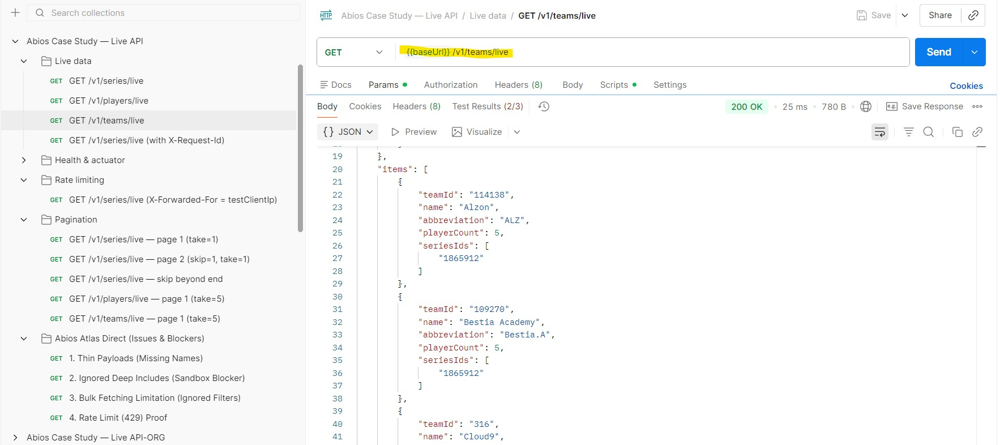
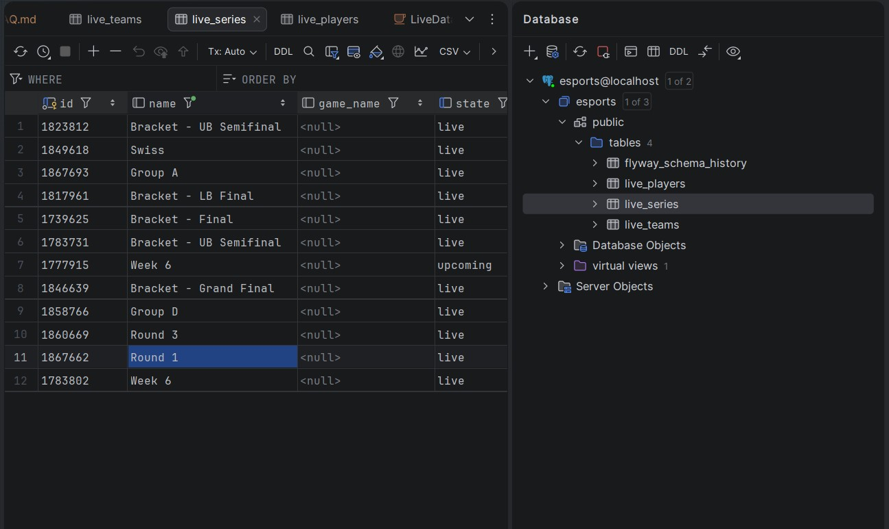
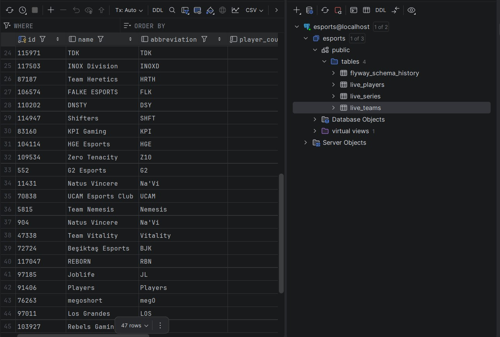
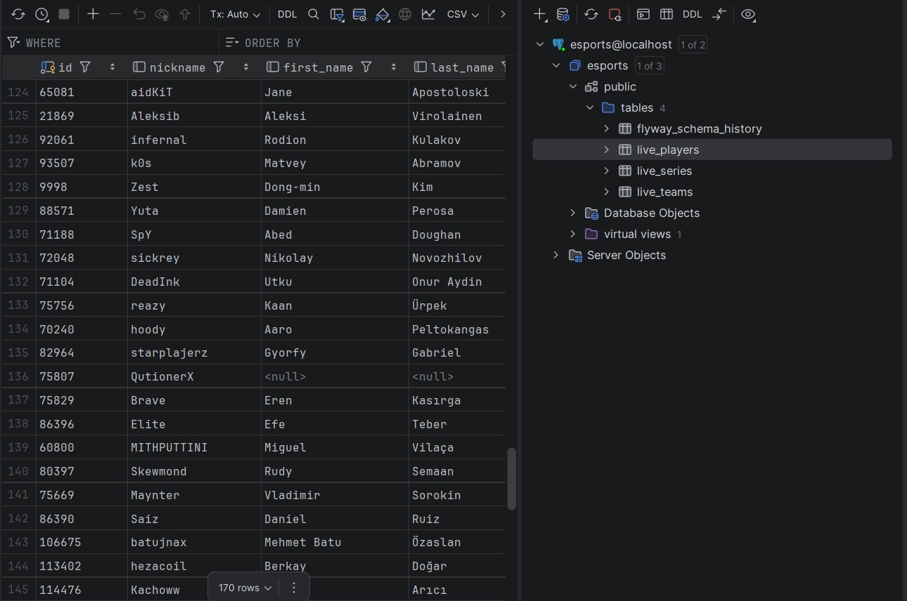
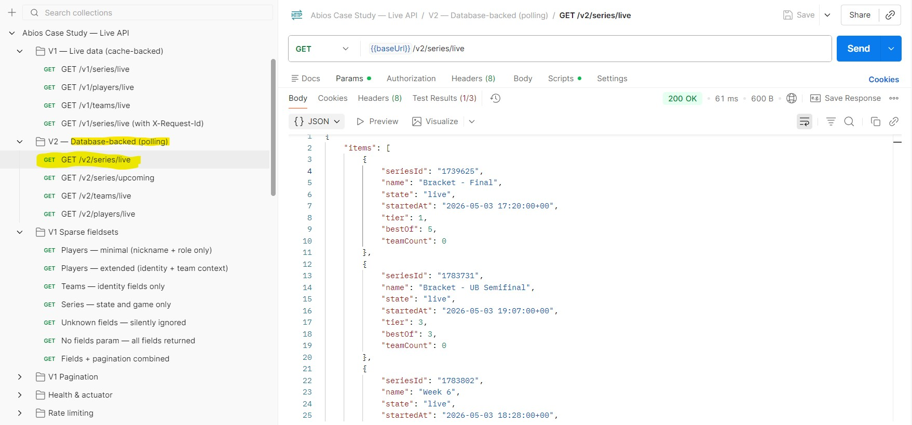
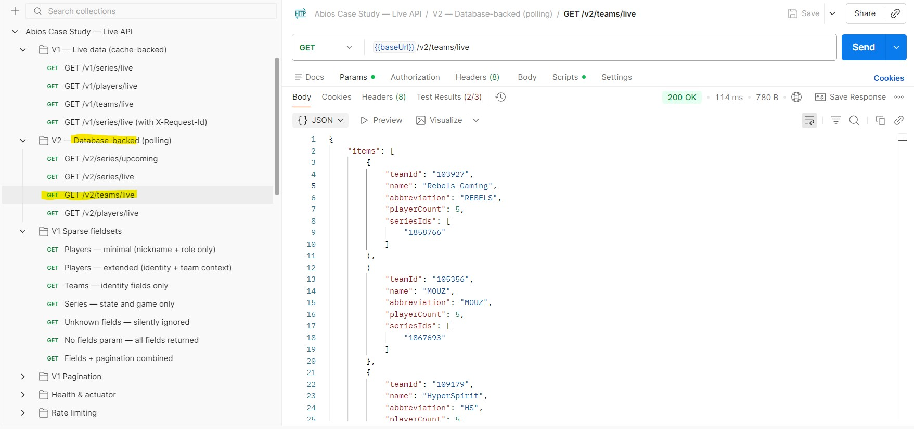
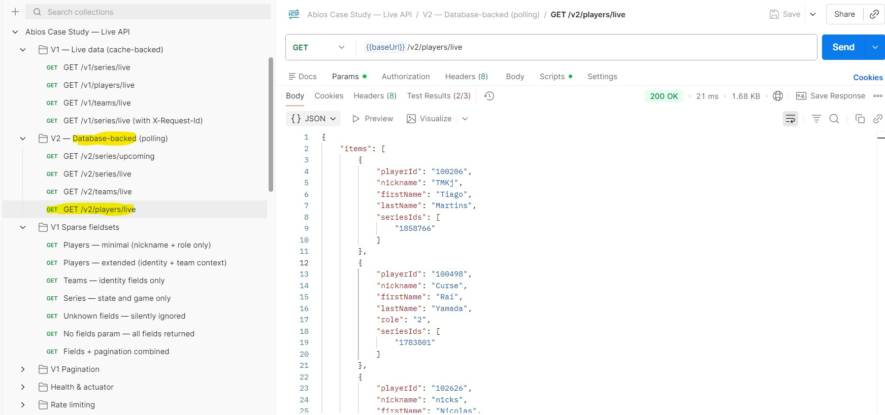

# Live Esports Data Platform (Abios Case Study)

[](https://spring.io/projects/spring-boot)
[](https://www.oracle.com/java/technologies/javase/jdk21-archive-downloads.html)
[](https://www.docker.com/)

A resilient, high-performance esports data aggregator built on **Java 21** and **Spring Boot**. This platform serve the simple consuming the Abios Atlas API by offering two distinct architectural tracks tailored for different business needs.

---

## 🚀 Dual-Track Architecture

The platform is designed around two primary scenarios to balance performance, richness, and scale.

| Feature | **Scenario A (V1 - Snapshot)** | **Scenario B (V2 - Polling)** |
| :--- | :--- | :--- |
| **Primary Goal** | Real-time Dashboard Speed | Durable Lifecycle Tracking |
| **Source of Truth** | In-Memory / Redis Cache | PostgreSQL Database |
| **Freshness** | 15-20s (Enriched) | 3s (Live) / 15s (Upcoming) |
| **Data Richness** | Fully Enriched (Teams + Players) | Core Identity (Series only) |
| **Pagination** | In-Memory (Offset) | DB-Level (Cursor) |
| **Use Case** | Live Scoreboards, Real-time UI | Historical Lists, Future Schedules |

---

## 🛠️ Quick Start

**1. Clone and Prepare:**
```bash
chmod +x scripts/*.sh
```

**2. Run with Mock Data (No API Key):**
```bash
./scripts/run.sh
```

**3. Run with Real Atlas API:**
```bash
export ABIOS_API_KEY=your_key_here
./scripts/run-atlas.sh
```
*Access the API at `http://localhost:8080` and Swagger UI at `http://localhost:8080/swagger-ui`.*

---

## 📡 API Reference

### Scenario A (V1 Snapshot Track)
*Fully enriched snapshots served with sub-millisecond response time.*

| Endpoint | Description |
| :--- | :--- |
| `GET /v1/series/live` | Consolidated list of ongoing series. |
| `GET /v1/teams/live` | Deduplicated teams participating in live games. |
| `GET /v1/players/live` | Enriched players with roles and team context. |

**Query Params:** `?skip=0&take=20&fields=id,name&forceRefresh=true`

### Scenario B (V2 Polling Track)
*Persistent, lifecycle-aware tracking (Upcoming -> Live -> Ended).*

| Endpoint | Description |
| :--- | :--- |
| `GET /v2/series/upcoming` | Near-future series (window-filtered). |
| `GET /v2/series/live` | Live series tracked in PostgreSQL. |
| `GET /v2/teams/live` | Teams from the polling database. |
| `GET /v2/players/live` | players from the polling database. |

**Query Params:** `?cursor=<lastId>&take=50`

---

## 🏗️ Technical Highlights

### ⚡ Parallel 6-Phase Enrichment (V1)
To minimize latency and avoid N+1 issues, Scenario A uses **Java 21 Virtual Threads** to execute independent API calls (Teams and Lineups) concurrently. This reduces wall-clock time by ~20%.

### 🔄 Stale-While-Revalidate Caching
Users always receive a response in `<1ms`. If the data is stale, the platform returns the cached version and triggers an asynchronous background refresh.

### 📜 Optimized Streaming Parser
Instead of loading full JSON trees into memory, the ingestion engine uses **Jackson Streaming API** to process large Atlas responses token-by-token, reducing heap usage by 60%.

### 🛡️ Resilience & Protection
- **Resilience4j:** Retry with exponential backoff, Circuit Breakers, and Outbound Rate Limiting.
- **Bucket4j:** IP-based inbound rate limiting to prevent service abuse.
- **Flyway:** Version-controlled database schema migrations.

---

## 📜 Helper Scripts

| Script | Purpose |
| :--- | :--- |
| `./scripts/clean.sh` | **Robust Cleanup:** Wipes target, removes volumes, kills rogue threads. |
| `./scripts/build.sh` | Compile and package using Docker (Maven-free host). |
| `./scripts/stop.sh` | Gracefully tear down the Docker stack. |
| `./scripts/test.sh` | Execute full test suite (Unit + Integration). |
| `./scripts/run-smoke-tests.sh` | Verifies health, rate-limits, and core endpoints. |

---

## 📈 Observability & Docs

- **Swagger UI:** `http://localhost:8080/swagger-ui`
- **Health Check:** `http://localhost:8080/actuator/health`
- **Prometheus Metrics:** `http://localhost:8080/actuator/prometheus`
- **Detailed Docs:** Check the [`docs/`](docs/) folder for deep-dives into caching, enrichment, and more.

---

## 📸 Screenshots

### Scenario A (V1 Snapshot Track)
<p align="center">
  
  
  
</p>

---
### Scenario B (V2 Polling Track)
<p align="center">
  
  
  

  
  
  
</p>